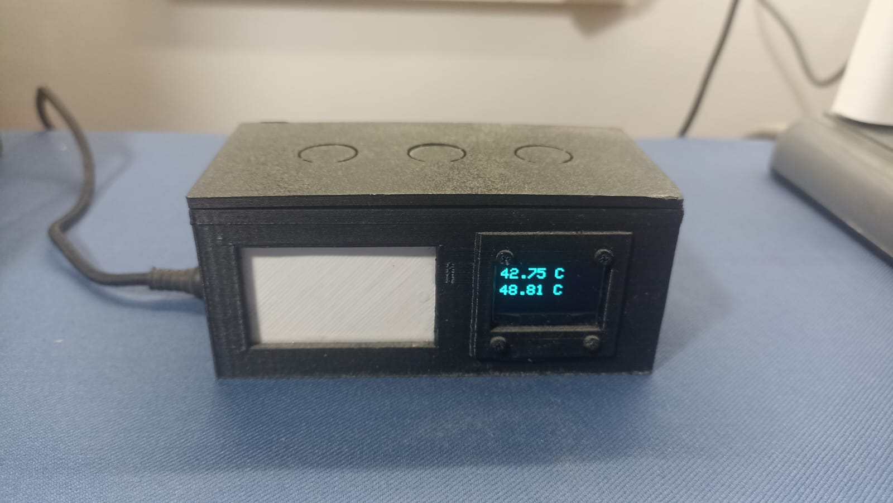
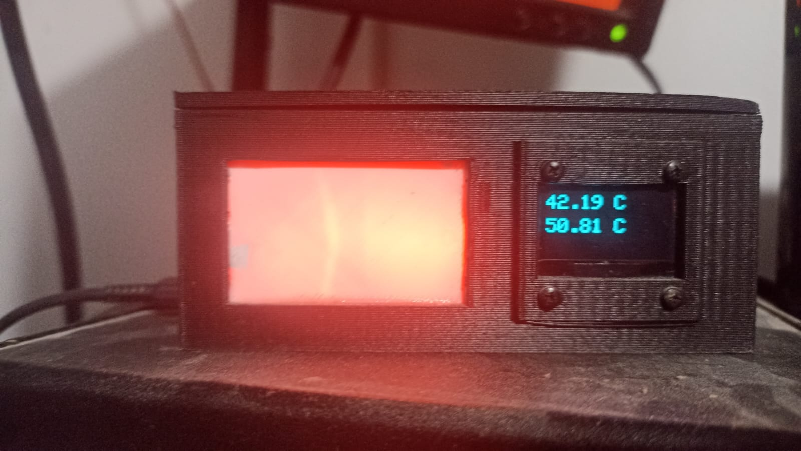
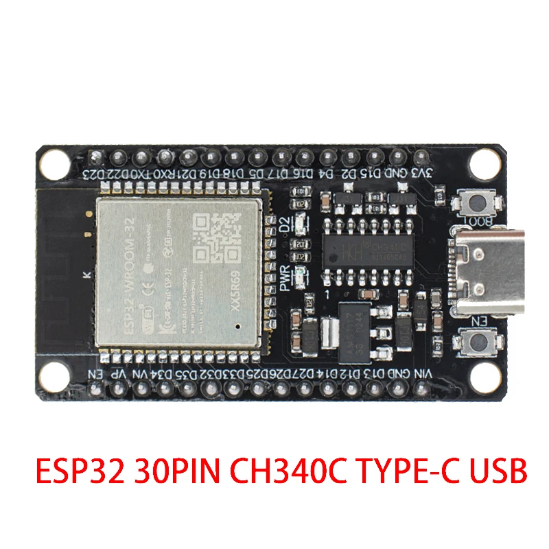
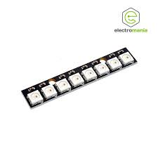
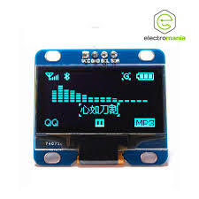
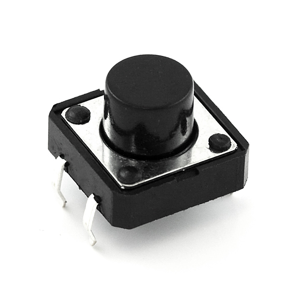

# ESP32 LED Notification System with OLED Display

## Overview

This project integrates an ESP32 with a WS2812B LED strip and an OLED display to create a visual notification system. The device subscribes to an MQTT channel to receive data and then displays the information on the OLED screen. In addition, it features color-coded LED alerts based on temperature thresholds and can act as a visual notifier for other events in the local network, such as a doorbell ring.

## Features

    *MQTT Subscription: The device connects to an MQTT broker to listen for messages on predefined topics.
    *OLED Display: Shows data received from the MQTT server in real-time.
    *WS2812B LED Strip: The LED strip changes colors according to predefined temperature thresholds or specific notifications.
    *Interactive Buttons: Included in the design for navigating through the display or controlling the LED strip.
    *Network Notifications: Can be configured to react to local network events, like a doorbell being rung.
    *Custom Endpoint: There's a created endpoint to interact with the system, allowing it to be turned on or off remotely.

## Hardware Components

### ESP32 microcontroller

### WS2812B LED strip

### OLED display

### Push buttons

## Enclosure

The electronic components are housed in a custom-designed 3D-printed enclosure that can be mounted or placed in a convenient location.

## Getting Started

To get this notification system running, you'll need to set up your ESP32 with the LED strip and the OLED display as detailed in the included schematics. Here is a basic rundown:

Hardware Setup: Assemble your ESP32, LED strip, OLED display, and buttons according to the provided schematics.

Hardware Setup

Firmware: Upload the provided code to the ESP32 using your favorite IDE or the esptool.py script.

MQTT Configuration: Ensure the ESP32 is configured to connect to your MQTT broker. Update the MQTT settings in the code to match your broker's IP address and port number.

OLED and LED Configuration: Adjust the settings in the code to define temperature thresholds or other conditions for the LED color changes.

Local Network Notifications: Configure the device to listen for specific network events, like a doorbell ring, by updating the notification settings in the code.

Endpoint Interaction: Use the custom endpoint to send commands to your ESP32 device to turn the LED strip on or off.

Power Up: Once everything is configured, power up your ESP32, and it should start displaying data on the OLED and responding to MQTT messages with visual notifications on the LED strip.

## Usage

The system is designed to be plug-and-play. Once powered on and configured, it will operate automatically, displaying data and notifications as they occur. The interactive buttons can be used to navigate through different data screens or control the LED notifications manually.

## Customization

The firmware is open for customization. You can set temperature ranges, display messages, and notification colors as per your requirements.

For further customization, modify the code to handle additional sensors or integrate with other systems in your smart home or office environment.

[Here's how to create a temperature sensor with esp32.](https://github.com/Itsmysecondacount/mqtt-esp32-read-temperature-of-solar-storage)

[Here's how to run and configure an mqtt server.](https://github.com/Itsmysecondacount/mqtt-server-whit-processor/tree/main)
